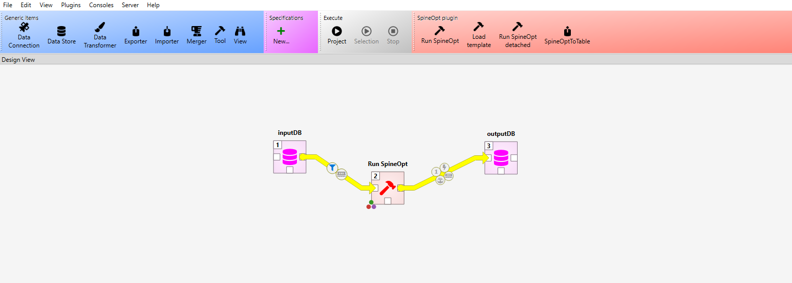
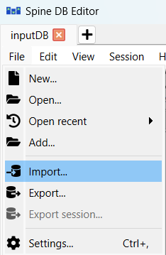

# Building a Model

This guide walks you through the process of building a model using MORPHE2US — from preparing input data to generating a structured Spine-compatible database for optimization.


---

## 🧰 Step 1: Prepare Your Input Files

MORPHE2US requires two key input files:

### 1. Excel File (`.xlsx`)

This file defines:

- 💡 Technologies (names, efficiencies, costs, emissions)
- 🧱 Nodes and carriers (e.g., electricity, heat, gas)
- 📈 Demands and capacity limits
- 📆 Simulation timeline (years and time slices)
- 🌍 Geographical zones (if any)
- 📏 Constraints (e.g., emissions limits)

> 📌 You can start from a template which can be provided.

### 2. Time Series File (`.json`)

This file provides time-dependent data, such as:

- Electricity demand profiles
- Heat demand
- Wind capacity factors
- Solar irradiation
- Dynamic pricing (if applicable)

📁 **Organize your input files like this:**

```
morpheus_project/
├── data/
│ ├── heatdemand_timeserie.json
│ ├── ...
│ └── timeseries.json
└── MORPHE2US.xlsx
```

> 📌 **Recommendation:** Provide time series in `.json` format and fill all other data directly in the Excel file. The `.json` data should follow the format described [here](#json-input-data-structure). All `.json` files in the `morpheus_project/data` folder will be read by the Python parser and integrated into the model.

---

## ⚙️ Step 2: Generate the Model

Use the MORPHE2US parser script to convert your input files into a SpineToolbox-compatible database.

### 🔧 Command

Run the following command from your project root:

```bash
python MORPHE2US_pipeline.py --excel MORPHE2US_Scenario_1.xlsx --output output_Scenario_1.json
```

The --excel and --output parameters aren't mandatory and are by default replaced by MORPHE2US.xlsx & output.json. When you use the default names, the simple following command can be exectuted:

```bash
python MORPHE2US_pipeline.py
```

This script:

- ✅ Validates and parses the Excel/JSON files
- 🔁 Converts the structure into Spine-compatible format
- 🧱 Creates a .json database ready to be loaded into SpineToolbox
- 💡 You can re-run the parser any time you update your input files.

---

## 🧩 Step 3: Load the Model into SpineToolbox

Now that the .json database has been created, you can open it using SpineToolbox.

### 📝 Steps

1. Launch SpineToolbox
2. Create or open a project with at least the following components: 
    - 1 Data Store (input SQLite database)
    -  1 Run SpineOpt (optimization engine)
    - 1 Data Store (output SQLite database)

3. In the input Data Store, use the integrated "Import" function as shown below:

4. Once the changes have been made to the Data Store, commit them to save.

---

## 🔍 Step 4: Verify and Validate

Before running your model in **SpineToolbox**, it is crucial to **verify and validate** the imported data to ensure accuracy and completeness.

---

### 📋 What to Check

#### **1. Technologies**
- Verify that all technologies (e.g., wind turbines, electrolyzers) are correctly listed.
- Check that their parameters (e.g., efficiency, costs, emissions) are filled and realistic.

#### **2. Time Series**
- Ensure that time series data (e.g., demand profiles, capacity factors) match the required **resolution** (hourly, daily, etc.).
- Confirm that the time series aligns with the simulation timeline.

#### **3. Nodes and Carriers**
- Check that all **nodes** (e.g., electricity grid, heat network) and **carriers** (e.g., electricity, hydrogen) are correctly defined.
- Validate that connections between nodes are properly established.

#### **4. Parameters**
- Review key parameters:
  - Costs (investment, operational)
  - Efficiencies
  - Emissions factors
  - Capacity limits

#### **5. Scenarios and Temporal Layers**
- Ensure that **scenarios** (below "Maps" in Spine) are correctly defined.
- Verify that **years and time slices** are properly configured.

---

## ✅ Step 5: Ready to Run

Your MORPHE2US model is now fully structured and loaded into SpineToolbox.

You can now proceed to the next step:

👉 [Running the Model](5_running_a_model.md)


---

## JSON Input Data Structure

The `.json` file should follow this structure:
```json
[
    {
        "parameter_name": "unit_name",
        "commodity": "commodity_name",
        "building": "building_name", // or "All"
        "district": "district_name", // or "All"
        "unit": "unit_name",
        "connection": "connection_name",
        "quantitative": false, // true if the values need to be multiplicated. Ex: heat demand for 1 building while there are 12 buildings in the district so times 12.
        "data": {
            "data": [
                0.002,
                0.011,
                0.014
            ],
            "index": {
                "start": "yyyy-mm-ddThh:mm:ss",
                "repeat": false, // Or true if it's cyclic
                "ignore_year": true, // ignore the yyyy in the data
                "resolution": "1h" // h for hours, D for days, M for months and Y for years
            },
            "type": "time_series" 
        }
    }
]
```        

## Example: `example.json`

```json
[
    {
        "parameter_name": "unit_availability_factor",
        "commodity": null,
        "building": null,
        "district": "All",
        "unit": "Wind Turbine (onshore-3.3MW)",
        "connection": null,
        "quantitative": false,
        "data": {
            "data": [
                0.002,
                0.011,
                0.014
            ],
            "index": {
                "start": "2025-01-01T00:00:00",
                "repeat": false,
                "ignore_year": true,
                "resolution": "1h"
            },
            "type": "time_series"
        }
        // OR
        "data": {
            "index": {
                "repeat": false,
                "ignore_year": true
            },
            "data": {
                "2025-01-01T00:00:00": 0.001964,
                "2025-01-01T01:00:00": 0.001718
            },
            "type": "time_series"
        }
    },
    {
        "parameter_name": "fix_ratio_out_in_unit_flow(from_node1to_node1)",
        // Efficiency from electricity (input node 1) to hydrogen (output node 1)
        "commodity": null,
        "building": "All",
        "district": "All",
        "unit": "H2-SO Electrolyzer 1MW",
        "connection": null,
        "quantitative": false,
        "data": {
            "data": {
                "2020-01-01T00:00:00": 0.659685420459087,
                "2025-01-01T00:00:00": 0.673892756549928,
                "2030-01-01T00:00:00": 0.69585900160386,
                "2040-01-01T00:00:00": 0.705409007987765,
                "2050-01-01T00:00:00": 0.724649458131531
            },
            "type": "time_series"
        }
    },
    {
        "parameter_name": "demand",
        "commodity": "Electricity",
        "building": "SFH",
        "district": "Kreis1",
        "unit": null,
        "connection": null,
        "quantitative": true,
        "data": {
            "index": {
                "repeat": false,
                "ignore_year": true
            },
            "data": {
                ...
            },
            "type": "time_series"
        }
    }
]
```